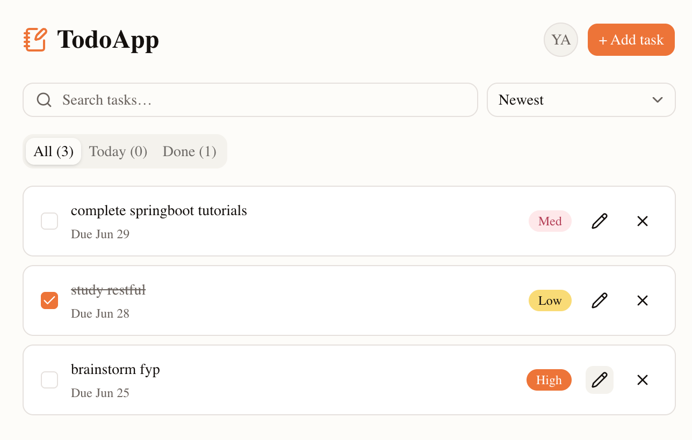

# TodoApp

A simple todo app I built for tracking college tasks.

## Screenshots




## Features

- **Sign up / Sign in** with email + password (Supabase Auth)
- **Add tasks** with title, optional due date, and priority (Low / Medium / High)
- **Edit, toggle complete, delete** tasks
- **Tabs**: All / Today (due today) / Done (completed)
- **Search** tasks by title (case-insensitive, with clear button)
- **Sort**: Due date (asc/desc), Priority, or Newest
- **Duplicate detection**: blocks creating a task with the same name as an active one
- **Sign out** via Avatar dropdown

## Tech Stack

- **Next.js 16** (App Router, Turbopack)
- **React 19**
- **TypeScript**
- **Tailwind CSS v4**
- **shadcn/ui** (base-nova preset) + **lucide-react** icons
- **Supabase** (Auth + Postgres + Row-Level Security)

## Getting Started

### 1. Install

```bash
npm install
```

### 2. Set up Supabase

1. Create a project at [supabase.com](https://supabase.com)
2. Copy your **Project URL** and **Publishable key** from `Settings → API`
3. Create `.env.local`:
   ```
   NEXT_PUBLIC_SUPABASE_URL=https://your-project.supabase.co
   NEXT_PUBLIC_SUPABASE_ANON_KEY=sb_publishable_xxx
   ```
4. In the Supabase dashboard, open **SQL Editor → New query** and run the schema + RLS policy from the project docs (you should have received them with the code — paste them in).

### 3. Run

```bash
npm run dev
```

Open [http://localhost:3000](http://localhost:3000) → sign up → start adding tasks.

## Project Structure

```
todoApp/
├── app/
│   ├── page.tsx               ← landing
│   ├── login/, signup/        ← auth pages
│   ├── dashboard/             ← main app (CRUD + tabs + search + sort)
│   ├── auth/callback/         ← (placeholder for future OAuth)
│   └── api/dbg/               ← DEBUG only — DELETE in V1.0
├── lib/supabase/              ← Supabase clients (client / server / middleware)
├── proxy.ts                   ← route protection (Next.js 16)
└── components/ui/             ← shadcn components
```

## Deploy

### Vercel (recommended for Next.js)

1. Push to GitHub
2. Import to [Vercel](https://vercel.com)
3. Add environment variables:
   - `NEXT_PUBLIC_SUPABASE_URL`
   - `NEXT_PUBLIC_SUPABASE_ANON_KEY`
4. Add a **Supabase redirect URL** for production:
   - In Supabase dashboard → `Authentication → URL Configuration`
   - Add `https://your-app.vercel.app/auth/callback`
5. Deploy

## Roadmap

- [ ] Time-left countdown for due dates
- [ ] V1.0: clean up debug code and add tests before sharing publicly

## License

MIT

## Acknowledgments

- [Next.js](https://nextjs.org) — the framework
- [Supabase](https://supabase.com) — auth + database + RLS
- [shadcn/ui](https://ui.shadcn.com) — component library
- [Tailwind CSS](https://tailwindcss.com) — styling
- [lucide](https://lucide.dev) — icons
- [Vercel](https://vercel.com) — hosting (recommended)